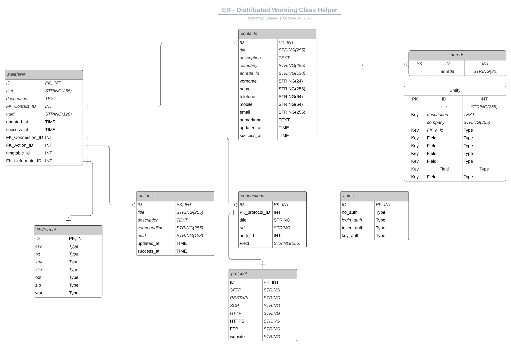
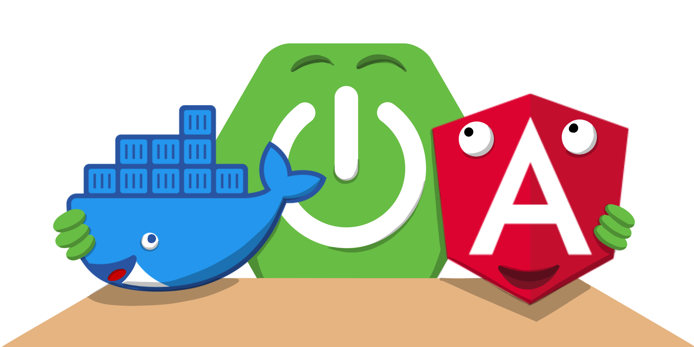
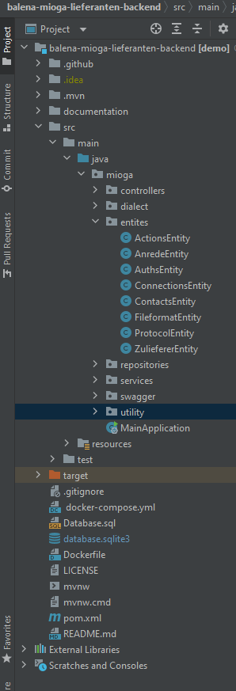
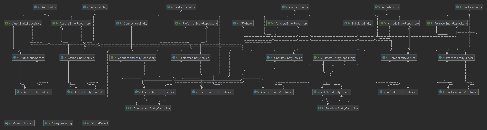
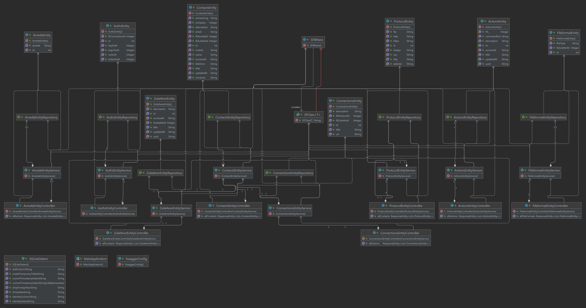
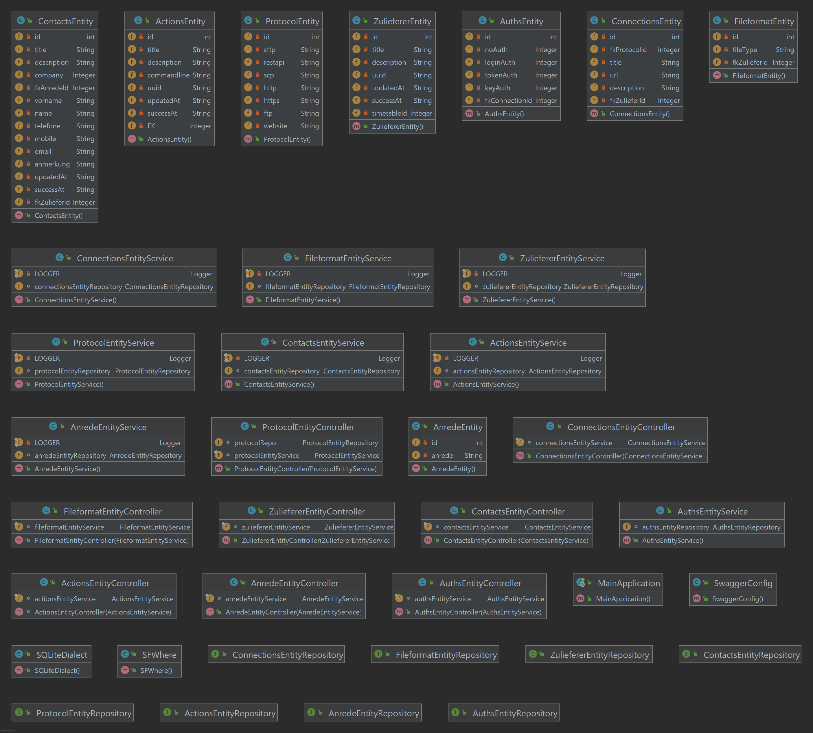
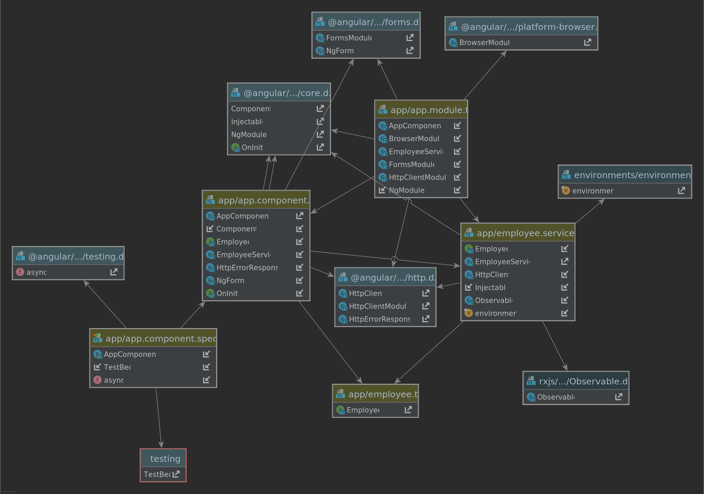

:toc:
:toc-placement!:
[options="header"]
[cols="1, 3, 3"]
|===

|Version | Bearbeitungsdatum   | Autor
|1.0	| 15.10.2021 | Mohamed Abdelshafi , Ahmad Abuzahra

|===

== Entwicklerdokumentation

=== Software-Vorgaben

* Docker
* Java OpenjdK + 11
* Springboot Framework
* Angular
* Balena CLoud
* Swagger
* SQlite
* AdminerLTE Template

Die folgenden (oder neueren) Browser-Versionen werden für die Anwenung benötigt:

* Internet Explorer / Edge 10.0
* Firefox 4.0
* Google Chrome 4.0
* Opera 9.6
* safari

=== Softwarearchitektur

==== Database-Schema

_Top-Level-Architektur der Anwendung_

== Backend Java Application

_Java Backend (Springboot Application)_

_Java Backend (UML Diagram)_

_Java Backend (Klassen Diagram)_

_Java Backend (Fields and Constructor)_

== FrontEnd Architecture (AngularApp)

_Frontend AngularApp (Klassen Diagram)_

image:images/gui_prototype/FrontendArch.png[]
